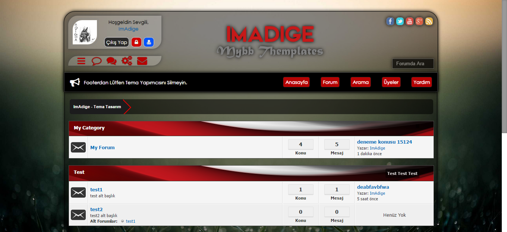
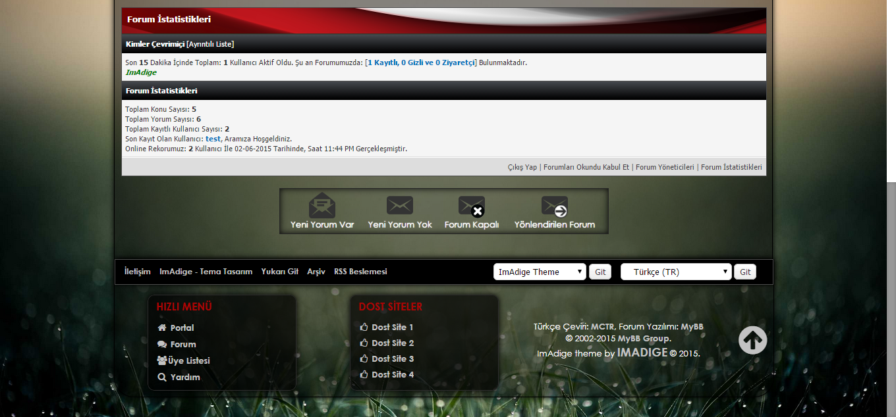
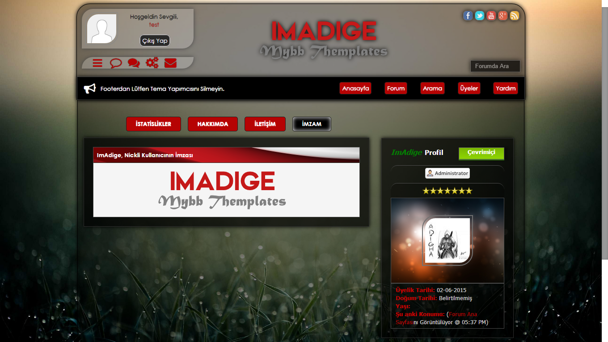
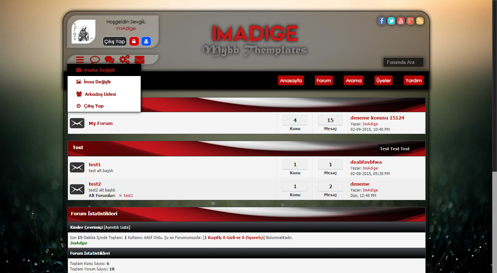
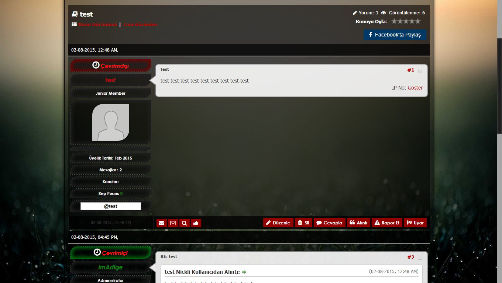
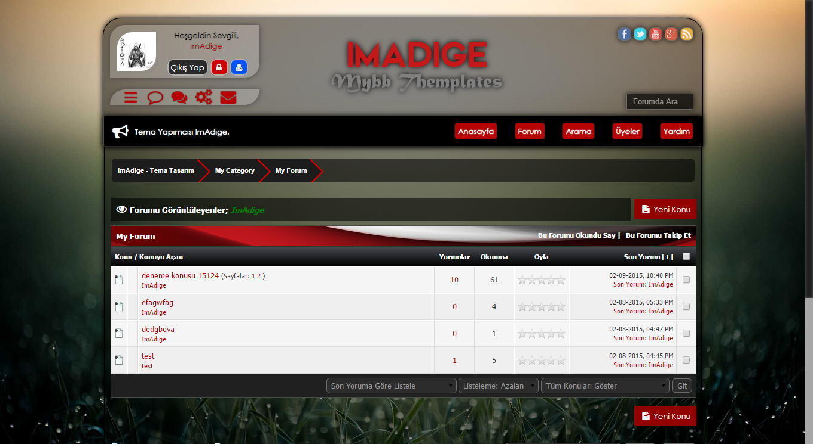

# imadige-theme-mybb


MyBB PHP forum sistemi için geliştirdiğim koyu renkli, modern ve kırmızı-siyah tasarıma sahip tema.

A dark, modern red-black theme developed for the MyBB PHP forum system.

---

## 🇹🇷 Türkçe

### Hakkında

**imadige-theme-mybb**, MyBB forum sistemi için hazırlanmış özel bir tema paketidir.  
Tema; koyu tasarım yapısı, kırmızı-siyah renk uyumu, özel kullanıcı alanları ve forum sayfaları için geliştirilmiş görsel düzenlemeler içerir.

Bu repository, temanın arşivlenmesi, geliştirilmesi ve paylaşılması amacıyla oluşturulmuştur.

### Önizleme

Tema ekran görüntüleri `Preview` klasörü içerisindedir.













### Özellikler

- MyBB 1.8.x uyumlu tema yapısı
- Koyu ve modern tasarım
- Kırmızı-siyah renk paleti
- Özel forum görünümü
- Özel konu görüntüleme sayfası
- Özel kullanıcı paneli tasarımı
- Tema XML dosyası
- FTP ile yüklenebilir tema dosyaları
- Önizleme ekran görüntüleri

### Repository Yapısı

```text
imadige-theme-mybb/
├── FTP_Files/
│   └── imadige/
├── Preview/
│   ├── preview_1.png
│   ├── preview_2.png
│   ├── preview_3.png
│   ├── preview_4.png
│   ├── preview_5.png
│   └── preview_6.png
├── ImAdige Theme v1.xml
├── LICENSE
└── README.md
```

### Kurulum

1. Bu repository’yi indirin veya klonlayın.

```bash
git clone https://github.com/1mAdige/imadige-theme-mybb.git
```

2. `FTP_Files/imadige` klasörünü MyBB kurulumunuzdaki uygun dizine yükleyin.

Genellikle tema görselleri ve dosyaları aşağıdaki dizine yüklenir:

```text
your-mybb-root/images/
```

3. MyBB Admin Panel’e giriş yapın.

```text
Admin CP > Templates & Style > Themes
```

4. `ImAdige Theme v1.xml` dosyasını içe aktarın.

5. Tema dosya yollarının doğru olduğundan emin olun.

6. Temayı varsayılan tema olarak ayarlayın veya kullanıcıların seçebilmesi için aktif hale getirin.

### Notlar

- Tema MyBB 1.8.x sürümleri için hazırlanmıştır.
- Daha yeni MyBB sürümlerinde küçük CSS veya template düzenlemeleri gerekebilir.
- Görseller görünmüyorsa `FTP_Files/imadige` klasörünün doğru dizine yüklendiğini kontrol edin.
- XML dosyasını içe aktardıktan sonra tema cache ayarlarını yenilemeniz gerekebilir.

---

## 🇬🇧 English

### About

**imadige-theme-mybb** is a custom theme package designed for the MyBB forum system.  
It includes a dark layout, red-black color palette, customized user areas and visual improvements for forum pages.

This repository was created for archiving, developing and sharing the theme.

### Preview

Theme screenshots are available in the `Preview` folder.


### Features

- MyBB 1.8.x compatible theme structure
- Dark and modern design
- Red-black color palette
- Custom forum layout
- Custom thread view page
- Custom user panel design
- Theme XML file included
- FTP uploadable theme files
- Preview screenshots included

### Repository Structure

```text
imadige-theme-mybb/
├── FTP_Files/
│   └── imadige/
├── Preview/
│   ├── preview_1.png
│   ├── preview_2.png
│   ├── preview_3.png
│   ├── preview_4.png
│   ├── preview_5.png
│   └── preview_6.png
├── ImAdige Theme v1.xml
├── LICENSE
└── README.md
```

### Installation

1. Download or clone this repository.

```bash
git clone https://github.com/1mAdige/imadige-theme-mybb.git
```

2. Upload the `FTP_Files/imadige` folder to the correct directory in your MyBB installation.

Theme images and files are usually uploaded to:

```text
your-mybb-root/images/
```

3. Go to your MyBB Admin Control Panel.

```text
Admin CP > Templates & Style > Themes
```

4. Import the `ImAdige Theme v1.xml` file.

5. Make sure all theme file paths are correct.

6. Set the theme as default or enable it for users.

### Notes

- This theme was created for MyBB 1.8.x.
- Newer MyBB versions may require small CSS or template adjustments.
- If images are not visible, check whether the `FTP_Files/imadige` folder was uploaded to the correct directory.
- After importing the XML file, you may need to rebuild or refresh theme cache.

---

## MyBB Community

Original MyBB community page:

https://community.mybb.com/mods.php?action=view&pid=389

---

## License

This project is licensed under the **GPL-3.0 License**.

See the [`LICENSE`](LICENSE) file for details.

---

## Author

Developed by **1mAdige**.

GitHub: https://github.com/1mAdige